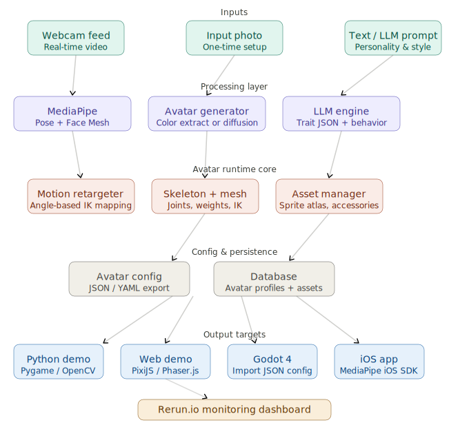

# Project_Avatar (WIP)


A real-time pixel art avatar pipeline that converts a photo into an animated avatar driven by webcam motion capture. Designed as a modular, game-engine-agnostic system with a web demo, Python prototype, and Godot 4 export target.



---

## Features

- **Photo-to-avatar generation** — extract skin, hair, and clothing colors from a photo and map to a pixel art sprite, or use a Stable Diffusion pipeline for full AI generation
- **Real-time webcam motion capture** — MediaPipe Pose + Face Mesh drives 12–16 avatar joints at 30+ fps
- **Angle-based retargeting** — proportionally correct motion transfer from your skeleton to the avatar skeleton
- **Idle animations** — breathing cycle, standby pose, and LLM-driven personality behaviors
- **Exportable config** — avatar defined as a portable JSON spec consumable by Godot 4, Unity, or any custom engine
- **Web demo** — fully browser-based with no backend required (MediaPipe WASM + PixiJS/Phaser.js)
- **Monitoring** — real-time joint visualization via `rerun.io`

---

## Architecture

```
Inputs
  Webcam feed          Input photo          Text / LLM prompt
       |                    |                      |
Processing
  MediaPipe            Avatar generator      LLM engine
  Pose + Face Mesh     Color extract /       Trait JSON +
                       Stable Diffusion      idle behaviors
       |                    |                      |
Avatar Runtime Core
  Motion retargeter    Skeleton + mesh       Asset manager
  Angle-based IK       Joints, weights       Sprite atlas,
  mapping              Spine2D format        accessories
                            |
Config & Persistence
               avatar_config.json       Database
               YAML export              (Supabase / SQLite)
                            |
Output Targets
  Python demo     Web demo        Godot 4        iOS app
  Pygame/OpenCV   PixiJS/Phaser   JSON import    MediaPipe SDK
```

---

## Quickstart

### Prerequisites

- Python 3.12+
- Node.js 18+ (for web demo)
- A webcam

### Python demo

```bash
git clone https://github.com/zeyuD/Project_Avatar.git
cd Project_Avatar
pip install -r requirements.txt
python demo/run_pygame.py --photo assets/sample_photo.jpg
```

### Web demo

```bash
cd web
npm install
npm run dev
# Open http://localhost:5173
```

---

## Project Structure

```
project_avatar/
├── core/
│   ├── capture.py          # MediaPipe webcam capture
│   ├── retarget.py         # Joint angle retargeting
│   ├── skeleton.py         # 2D skeleton + IK solver
│   └── asset_manager.py    # Sprite atlas loader
├── generation/
│   ├── photo_to_avatar.py  # Color extraction pipeline
│   ├── diffusion.py        # Stable Diffusion + LoRA (optional)
│   └── llm_traits.py       # LLM trait JSON generation
├── demo/
│   └── run_pygame.py       # Python Pygame demo
├── web/
│   ├── src/
│   │   ├── capture.js      # MediaPipe WASM wrapper
│   │   ├── avatar.js       # PixiJS skeletal renderer
│   │   └── retarget.js     # JS angle-based retargeting
│   └── package.json
├── export/
│   ├── config_schema.json  # Avatar config JSON schema
│   └── godot_plugin/       # Godot 4 GDScript importer
├── monitoring/
│   └── rerun_logger.py     # rerun.io pose visualization
├── assets/
│   ├── sprites/            # Pixel art sprite atlases
│   └── sample_photo.jpg
├── requirements.txt
└── README.md
```

---

## Avatar Config Format

Avatars are serialized as a self-contained JSON file that decouples generation from rendering:

```json
{
  "version": "1.0",
  "appearance": {
    "skin_color": "#F1C27D",
    "hair_color": "#4A2C0A",
    "hair_style": "short_straight",
    "eye_color": "#5B3A29",
    "outfit": "casual_hoodie",
    "outfit_color": "#3B5998",
    "accessories": ["glasses"]
  },
  "skeleton": {
    "format": "spine2d",
    "atlas": "sprites/avatar_atlas.png",
    "joints": 14
  },
  "personality": {
    "idle_style": "relaxed",
    "traits": ["curious", "friendly"],
    "breathing_period_s": 4.2
  }
}
```

---

## Key Dependencies

| Layer | Package | Purpose |
|---|---|---|
| Motion capture | `mediapipe` | Pose + Face Mesh landmarks |
| Python rendering | `pygame` | Demo window + sprite drawing |
| Web rendering | `pixi.js`, `phaser` | WebGL pixel art renderer |
| Photo processing | `opencv-python`, `Pillow` | Color extraction |
| AI generation | `diffusers` (HuggingFace) | Stable Diffusion + LoRA |
| Face detection | `face_recognition` | Face region isolation |
| Monitoring | `rerun-sdk` | Real-time pose visualization |
| Config | `pyyaml`, `jsonschema` | Avatar config I/O |

Install Python dependencies:

```bash
pip install mediapipe opencv-python Pillow face_recognition pygame pyyaml rerun-sdk
# Optional: AI generation
pip install diffusers transformers torch
```

---

## Motion Retargeting

The retargeter uses **angle-based transfer** (not position-based) to avoid drift when the webcam skeleton and avatar skeleton have different proportions.

```python
from core.retarget import AngleRetargeter

retargeter = AngleRetargeter(source_skeleton="mediapipe_33", target_skeleton="avatar_14")
avatar_pose = retargeter.transfer(mediapipe_landmarks)
```

Key joints: head, neck, left/right shoulder, elbow, wrist, hip, knee, ankle (14 total for v1).

---

## LLM Integration

The LLM is used **offline at setup time**, not in the real-time loop. A multimodal model (Claude / GPT-4o) reads the input photo and outputs a structured trait profile:

```python
from generation.llm_traits import generate_traits

traits = generate_traits(photo_path="photo.jpg")
# Returns: {"style": "casual", "accessories": ["glasses"], "idle": "relaxed", ...}
```

At runtime, idle behavior (gesture timing, blink rate, head tilt) is driven by the pre-generated trait JSON — no LLM latency on the hot path.

---

## Roadmap

- [x] MediaPipe capture + joint angle extraction
- [x] Python Pygame demo
- [ ] Color-based photo-to-avatar mapping
- [ ] Avatar config JSON schema
- [ ] Web demo (PixiJS + MediaPipe WASM)
- [ ] Stable Diffusion pixel art generation pipeline
- [ ] Spine2D skeletal mesh integration
- [ ] Godot 4 plugin
- [ ] LLM trait generation interface
- [ ] iOS app (MediaPipe iOS SDK + Swift/Flutter)
- [ ] Shareable avatar config web editor

---

## Contributing

Pull requests welcome. For major changes, please open an issue first to discuss what you'd like to change.

1. Fork the repo
2. Create a feature branch (`git checkout -b feature/my-feature`)
3. Commit your changes (`git commit -m 'add my feature'`)
4. Push and open a PR

---

## License

<!-- MIT -->

